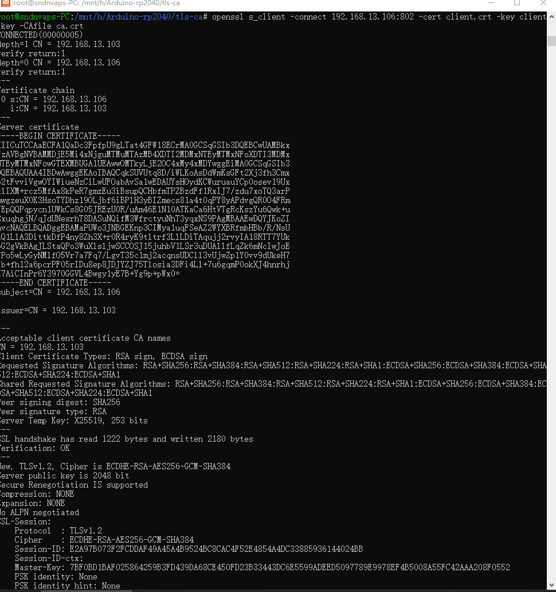

--
 - ca     CN=192.168.13.103
 - server CN=192.168.13.106
 - client CN=192.168.13.103
 
# how to gen the ca & server.crt client.crt files

```bash
$openssl genrsa -des3 -out ca.key 2048
$openssl req -x509 -new -nodes -key ca.key -sha256 -days 365 -out ca.crt -subj "/CN=192.168.13.103"

$openssl genrsa -out server.key 2048
$openssl req -new -key server.key -out server.csr -subj "/CN=192.168.13.106"


$openssl x509 -req -in server.csr -CA ca.crt -CAkey ca.key -CAcreateserial -out server.crt -days 365 -sha256

openssl genrsa -out client.key 2048
$openssl req -new -key client.key -out client.csr -subj "/CN=192.168.13.103"

$openssl x509 -req -in client.csr -CA ca.crt -CAkey ca.key -CAcreateserial -out client.crt -days 365 -sha256

```

# Test tls connect

```bash
$openssl s_client -connect 192.168.13.106:802 -cert client.crt -key client.key -CAfile ca.crt
```

